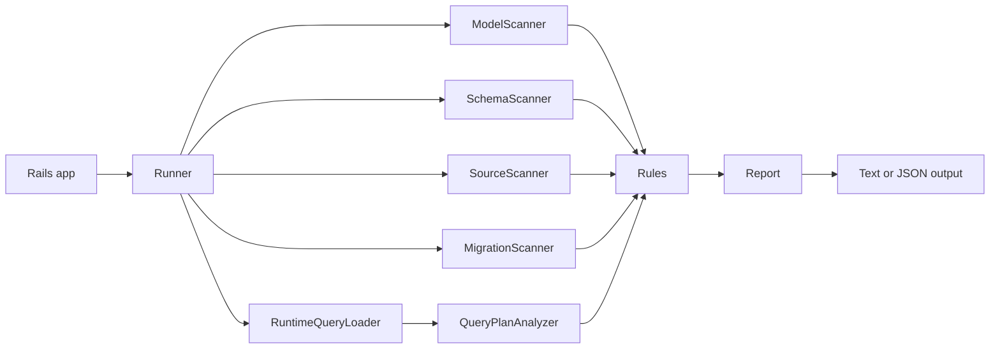

# Architecture

`active_record_optimizer` is a Rails gem that turns model, schema, source, migration, runtime-query, and optional planner evidence into CI-friendly findings.

The architecture is intentionally a small pipeline:

## Runtime Boundary

`ActiveRecordOptimizer::Runner` is the orchestration boundary. It builds a context from:

- `SchemaScanner`: table, column, index, and foreign-key evidence from the active connection.
- `ModelScanner`: loaded Active Record model and reflection evidence.
- `SourceScanner`: simple source-level Active Record query patterns.
- `MigrationScanner`: migration changes that imply missing database constraints.
- `RuntimeQueryLoader`: opt-in query snapshot artifacts.
- `QueryPlanAnalyzer`: optional PostgreSQL planner evidence for explainable runtime SQL.

The runner then applies the rule registry and returns a `Report` with versioned metadata.

## Rule Boundary

Rules are grouped by evidence owner instead of by output severity:

- `AssociationRules`: model/reflection-backed association risks.
- `SchemaRules`: schema and database-integrity risks.
- `QueryPatternRules`: source/runtime query-shape risks.
- `MigrationRules`: migration patterns that can create unsafe schema drift.

Rules consume a read-only context and return findings. They do not mutate the Rails app, database, migrations, or source files.

## Contract Boundary

Machine consumers depend on explicit contracts:

- report JSON schema: `docs/json-report-schema-v1.json`
- runtime query snapshot schema: `docs/runtime-query-snapshot-schema-v2.json`
- retained v1 snapshot schema for compatibility: `docs/runtime-query-snapshot-schema-v1.json`

`docs/contract-versioning.md` defines when schema versions must change. Published schemas are part of the repository contract and are validated by tests/package checks.

## Configuration Boundary

Configuration is strict:

- unknown keys fail fast;
- invalid value types fail fast;
- missing explicit config paths fail fast;
- thresholds must be valid integers;
- ignored findings and ignored tables are explicit opt-outs.

This avoids a dangerous state where CI appears green because a typo or malformed config silently disabled evidence.

## Packaging Boundary

`ActiveRecordOptimizer::PackageAudit` verifies that the built gem carries the public contract artifacts and can be required/used from an isolated install. The package audit keeps GitHub documentation, packaged schemas, and runtime behavior aligned.

## Non-Goals

- It is not a general Ruby style linter.
- It does not execute arbitrary application code for source inference.
- It does not automatically create indexes or migrations.
- It does not claim PostgreSQL planner evidence unless the user explicitly provides explainable runtime SQL.
- It does not treat runtime snapshots with literalized binds as safe public artifacts.
